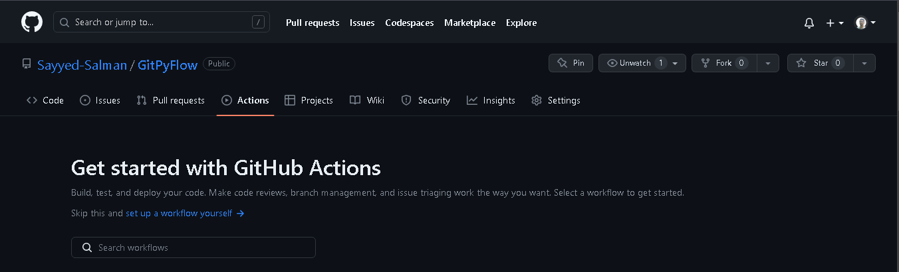
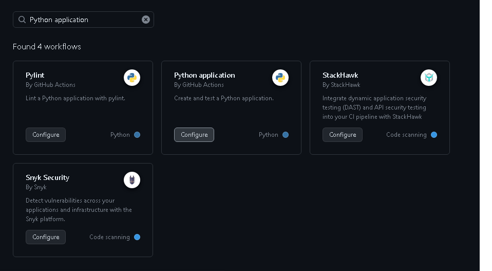
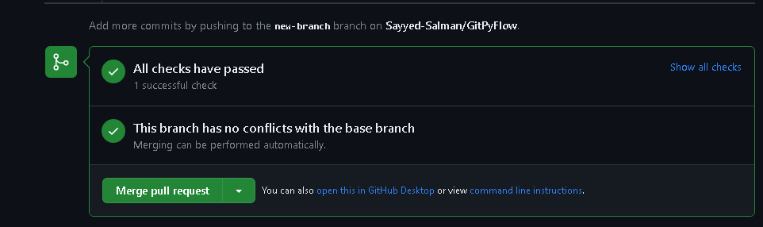
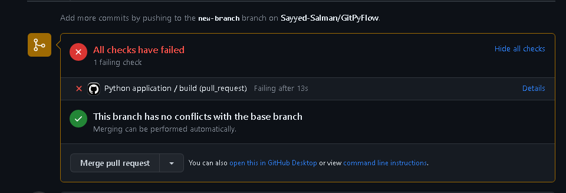
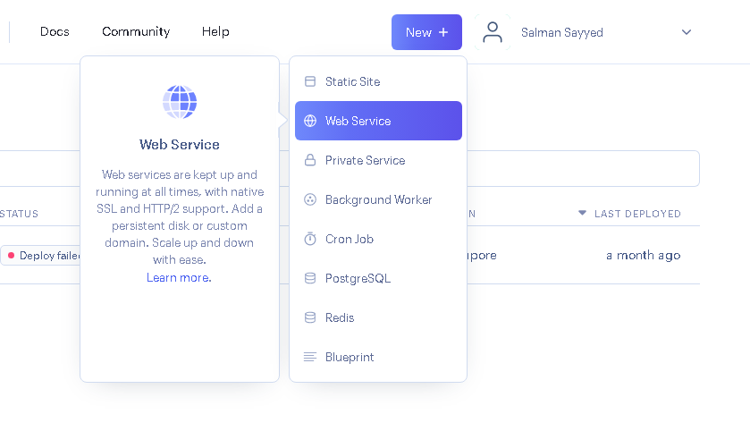
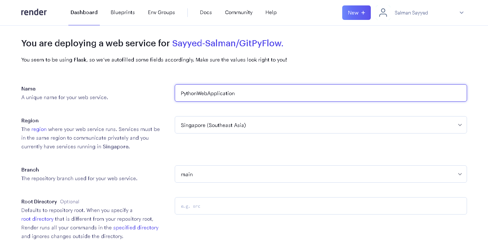
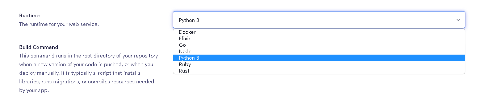
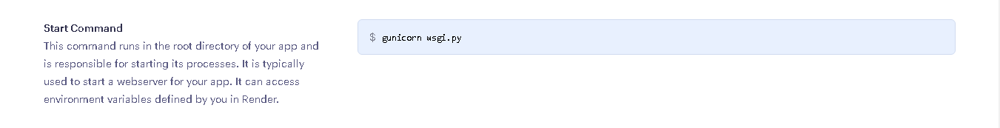

# Automating Your Python Application's Workflow: Creating a CI/CD Pipeline with GitHub Actions

## Introduction

Deploying and testing a Python application can be a tedious task. In this article, we will see how to deploy a Python application on GitHub using GitHub Actions.
We will create a simple Python application and then deploy it on GitHub using GitHub Actions. We will also see how to test the application using GitHub Actions.

### What is GitHub Actions?

[GitHub Actions](https://github.com/features/actions) is a platform that allows developers to automate workflows in their repositories. It provides a way to create custom workflows that can be triggered by events, such as code pushes, pull requests, or releases. With GitHub Actions, developers can automate tasks such as building and testing code, deploying applications, and sending notifications.

### What is CI/CD?

Continuous Integration and Continuous Deployment (CI/CD) is a software engineering practice where developers frequently merge their code changes into a central repository, which is then automatically built, tested, and deployed. This ensures that the code changes are always tested and verified, and that the deployed application is always up-to-date.

## Prerequisites

- Basic knowledge of Python
- Basic knowledge of Git
- GitHub account
- [render](https://render.com/) account

### Install libraries

```bash
pip install flask pytest
```

## Setting up a workflow for a python application

#### 1) Create a flask application

Create a new directory and create a file named `__init__.py` in it.

Directory structure:


Add the following code to the file:

1. `app\__init__.py`

```python
from flask import Flask


def create_app(config=None):
    app = Flask(__name__)

    @app.route('/')
    def index():
        return 'Hello World'

    @app.route('/add/<int:num1>/<int:num2>')
    def add(num1, num2):
        return f"{num1} + {num2} = {num1 + num2}"

    return app
```

2. `wsgi.py`

```python
from app import create_app

if __name__ == '__main__':
    app = create_app()
    app.run()
```

Now run the application using the following command:

```bash
python wsgi.py
```

Create a `tests` directory and create a file named `__init__.py` and `test_app.py` in it.
We need to create some test cases for our application, These test cases will be executed in the GitHub Actions workflow.

Add the following code to the file:

```python
import unittest
from app import create_app


app = create_app()


class TestAddFunction(unittest.TestCase):

    def test_addition(self):
        with app.test_client() as client:
            response = client.get('/add/4/5')
            self.assertEqual(response.status_code, 200)
            self.assertEqual(response.data.decode(), '4 + 5 = 9')

    def test_missing_variable(self):
        with app.test_client() as client:
            response = client.get('/add/4/')
            self.assertEqual(response.status_code, 404)

    def test_invalid_variable(self):
        with app.test_client() as client:
            response = client.get('/add/4/foo')
            self.assertEqual(response.status_code, 404)

```

Now run the test cases using the following command:

```bash
python -m unittest discover -s tests
```

All of these test cases should pass.
Finally, we need to create a `requirements.txt` file to install the dependencies.
The only library we need is `flask`. so add the following line to the file:

```txt
flask
```

You can also add other dependencies if you want. For example, if you want to use `pytest` instead of `unittest`, you can add `pytest` to the `requirements.txt` file.
You can also automatically generate this file using the following command

```bash
pip freeze > requirements.txt
```

All the code for this application can be found [here](https://github.com/Sayyed-Salman/GitPyFlow).

#### 2) Create a GitHub repository

1. Create a new repository on GitHub.
2. Push the code to the repository.

Finally, we have a simple Python application that we want to deploy on GitHub.
Not only do we want to deploy the application, but we also want to test it.

#### 3) Create a workflow file

Go to "Actions" tab and find "Python Applications".



Find "Python application" and click on "Configure"



This will create a workflow file in the `.github/workflows` directory.
Edit this file to customize the workflow.

```yaml
name: Python application

on:
  push:
    branches: ["main"]
  pull_request:
    branches: ["main"]

permissions:
  contents: read

jobs:
  build:
    runs-on: ubuntu-latest

    steps:
      - uses: actions/checkout@v3
      - name: Set up Python 3.10
        uses: actions/setup-python@v3
        with:
          python-version: "3.10"
      - name: Install dependencies
        run: |
          python -m pip install --upgrade pip
          pip install flake8 pytest
          if [ -f requirements.txt ]; then pip install -r requirements.txt; fi
      - name: Lint with flake8
        run: |
          # stop the build if there are Python syntax errors or undefined names
          flake8 . --count --select=E9,F63,F7,F82 --show-source --statistics
          # exit-zero treats all errors as warnings. The GitHub editor is 127 chars wide
          flake8 . --count --exit-zero --max-complexity=10 --max-line-length=127 --statistics
      - name: Test with pytest
        run: |
          pytest
```

This workflow will run on every push and pull request on the `main` branch.
It will install the dependencies and run the tests.
If the tests fail, the workflow will fail.
This is a very simple workflow, but it can be customized to do more complex tasks.

#### 4) Test it

1. Create a new branch and make some changes to the code.

Go ahead and make some changes to the code. For example, you can change the `index` function to return "Hello Flask!" instead of "Hello World".

```python
@app.route('/')
def index():
    return 'Hello Flask!'
```

2. Create a pull request.

Create a new branch and push the changes to the repository.

```bash
git checkout -b new-branch
git add .
git commit -m "change index function"
git push origin new-branch
```

3. The workflow will run and the tests will be executed.

Go to GitHub and create a pull request.
Merge the pull request.
It will trigger the workflow and the tests will be executed.The workflow executed successfully.



To break the workflow, change the `add` function to return the wrong result.

```python
@app.route('/add/<int:num1>/<int:num2>')
def add(num1, num2):
    return f"{num1} + {num2} = {num1 + num2 + 1}"
```

There is another way to break the workflow.
Import a library that is not in the `requirements.txt` file.

```python
import requests
```

This will cause the workflow to fail.



## Deploying the application on Render

1. Create a new account on Render.

2. Link your GitHub account to Render.

3. Create a new web service.

If you signed up with GitHub, you will see a list of your repositories.
Select the repository you want to deploy.



4. Select the GitHub repository.
5. Select the branch.

Fill in the fields.



6. Select the environment.

Select an environment from the list.


7. Select the start command.
   Start command is the command that will be executed when the application starts.
   It is the Flask app entry point it creates the Flask app object and runs it.



Render will automatically detect the start command if you have a `Procfile` in the root directory.
If you don't have a `Procfile`, you can create one and add the start command to it.

Add guincorn to the `requirements.txt` file.

```txt
web: gunicorn wsgi:app
```

This is CD part of the CI/CD pipeline. It will automatically deploy the application when you push changes to the repository.

## Conclusion

In conclusion, using GitHub Actions to set up a CI/CD pipeline for your Python application can make your development process smoother and more efficient. With GitHub Actions, you can automate the process of testing, building, and deploying your application, saving you time and effort. Once you've set up your pipeline, you can easily push updates to your application and have them automatically built and deployed. Plus, by using Render to deploy your application, you can easily share it with others and make it accessible to anyone with an internet connection. So if you're looking for a way to streamline your Python application's development process, give GitHub Actions and Render a try and see how they can help you simplify your workflow.
